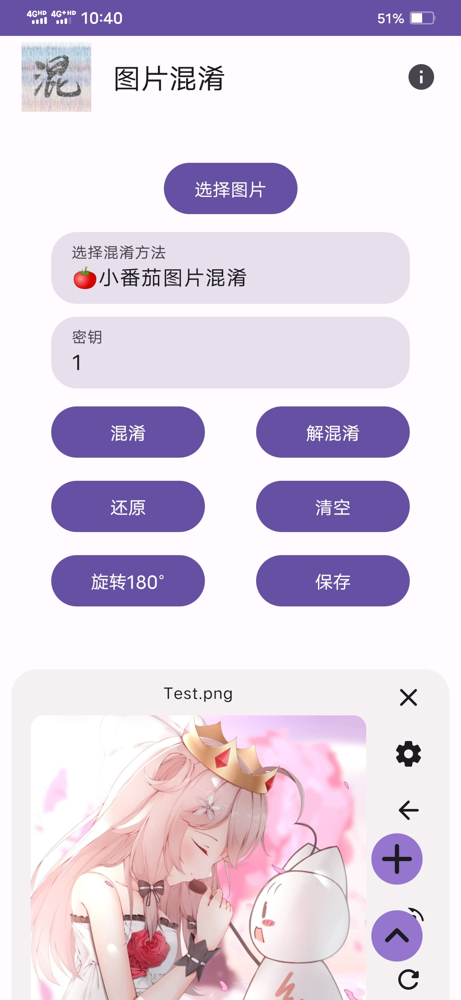
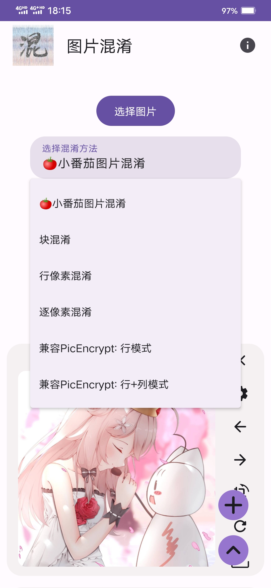

<h1 align="center">
  
   
  图片混淆APP
   
</h1>

<h3 align="center">
一个使用特定算法打乱图片像素的应用
</h3>

---

## 简介

本应用名和图标来自于百度贴吧的图片混淆吧，你能够使用这个应用来打乱一张图片的像素，使其看不出原貌，看起来像一堆乱码，同时也能对这些打乱的像素进行反向处理，还原回原来的图片。

## 预览图

| 图1                         | 图2                          |
|----------------------------|-----------------------------|
|  |   |

## 使用要求

- Android: 7.0 - 13.0

## 功能特点

- 支持6种图片混淆方法包括：小番茄图片混淆、块混淆、行像素混淆、逐像素混淆、兼容PicEncrypt行模式和兼容PicEncrypt行+列模式的混淆方法。
- 支持在相册选取、保存图片
- 支持图片旋转180°
- 支持批量添加、处理多张图片
- 支持对每张图片单独处理
- 无需手机存储权限（除了Android 8.0）
- 使用多线程加速图片处理

## 使用方法

首先在本项目的右侧点击Releases打开发布页面，找到最新版本的应用安装包（.apk文件）下载并安装到手机。

打开后选择并导入图片，完成后即可看到应用主界面，点击选择混淆方法可以切换不同的混淆方法，使用不同混淆方法处理图片得到的图片也不同，各具特点。

密钥输入框可以为图片混淆设置密钥，即使使用同一种混淆方法，如果密钥不同，得到的图片也不同，所以，要将一张混淆后的图片还原，必须要使用相同的混淆方法和密钥。

混淆和解混淆按钮用于对图片像素进行打乱，两者对图片处理的操作是相反的，如果你混淆了一次图片，那么要还原，就要反向操作，点一次解混淆；而如果你解混淆了一次图片，要还原，就要点一次混淆。

还原按钮用于将图片恢复为刚导入应用时的样子。清空按钮可以清空导入应用的图片。

旋转180°按钮能将图片旋转180°。保存按钮能将图片保存到相册。

另外，每张图片右侧也有相关的按钮能对单张图片进行单独操作。

## 说明

Android 8.0必需允许存储权限才能保存图片，加载图片无需存储权限，其它兼容版本无需存储权限。

不同混淆方法允许的密钥取值范围不同：

| 混淆方法                 | 密钥取值         |
| ---------------------- | --------------- |
| 小番茄图片混淆            | 大于0，小于1.618  |
| 块混淆                  | 任意字符串        |
| 行像素混淆               | 任意字符串        |
| 逐像素混淆               | 任意字符串        |
| 兼容PicEncrypt: 行模式   | 大于0，小于1      |
| 兼容PicEncrypt: 行+列模式 | 大于0，小于1      |

## 无法还原原图的常见原因

1.没有使用原图、图片被压缩过

使用来自网络的图片时没有以原图保存下来，或者图片在上传到网上时已被压缩过。

2.混淆方法不匹配，密钥不正确

3.图片混淆或解混淆的顺序或次数不对

在对图片进行多次的混淆、解混淆操作后，要进行相应次数的反向操作才能得到原图，比如先对原图进行了一次小番茄算法的解混淆，然后又连续进行了2次块混淆的混淆，那么要将这样处理过的图片还原为原图，就要逆序反向操作，先进行2次块混淆的解混淆，然后再进行1次小番茄算法的混淆，得到原图。

至于一张混淆图片所用的具体混淆方法、密钥，混淆、解混淆顺序或次数如何，请求助图片制作者。

## 参考

- [https://xfqtphx.netlify.app/](https://xfqtphx.netlify.app/)
- [https://www.axe.ink/blog/encrypt](https://www.axe.ink/blog/encrypt)
- [https://github.com/goldsudo/PicEncryptApp](https://github.com/goldsudo/PicEncryptApp)